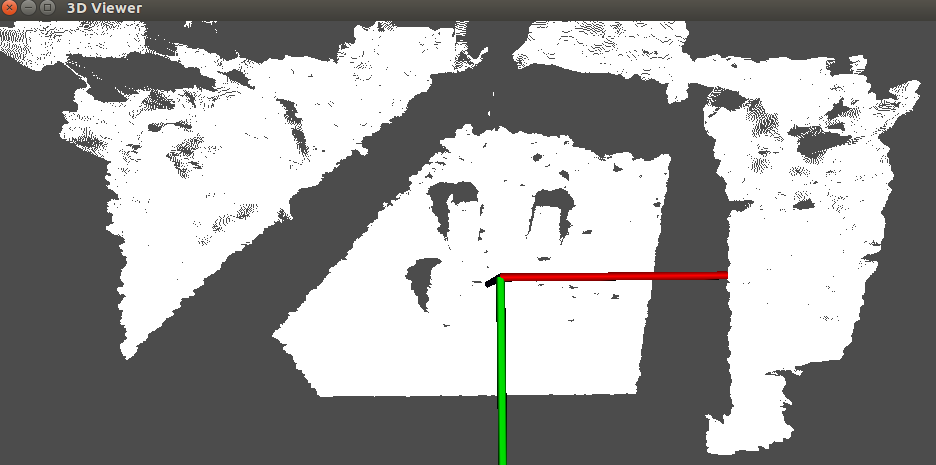
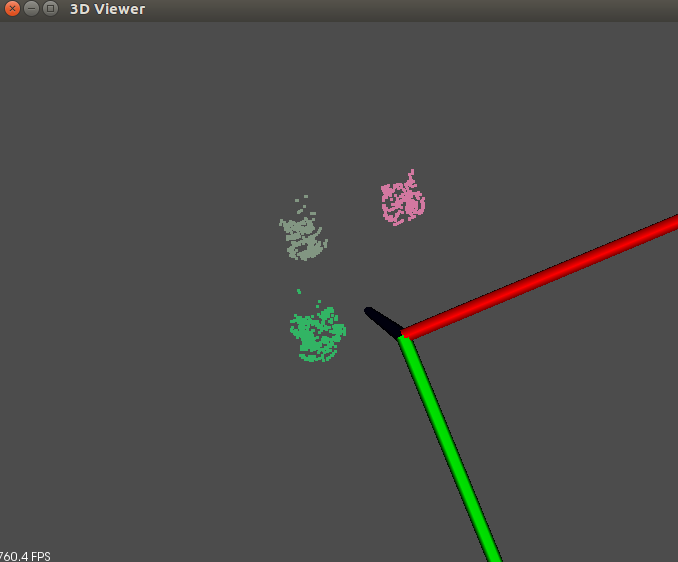

# GraspingHelper
Utilizing realsense libraries and PCL to segment and localize cylinders on the desktop. Using Realsense D-series RGB-D camera. 

## Data

## Implementation
* Utilizing number of cylinders provided by user in advance to save computation time and enhance accuracy;

* StatisticalFilter can save about 0.02-0.04s and enhance accuracy as well;

* 'LeafSize' in voxelization is quite powerful for save computation time;

* RegionGrowing does not work well in my case. Probably because of collections of outliers are hard to remove which are all counted into result;

## Results

